# 基于Springboot的飘香水果购物网站

## Springboot-0054


## 技术栈

Springboot mybatisplus vue mysql maven


## 数据库表(18张)


## 功能介绍

```properties
管理员功能有，个人中心管理，用户管理，会员管理，会员卡管理，开通会员记录管理，积分管理，水果管理，购买水果订单管理，积分兑换管理，积分兑换记录管理，加积分记录管理，减积分记录管理。用户可以注册登录，在首页开通会员卡，查看水果，购买水果，查看水果信息，以及个人中心修改个人资料，在自己的后台查看自己的购买记录等。
```


## 图片

### 前台


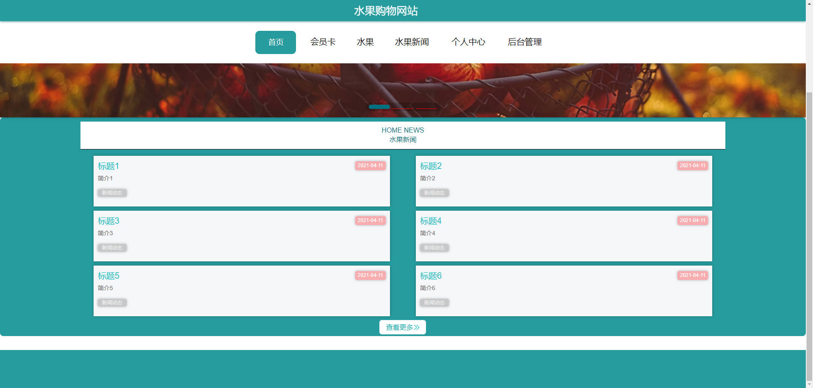

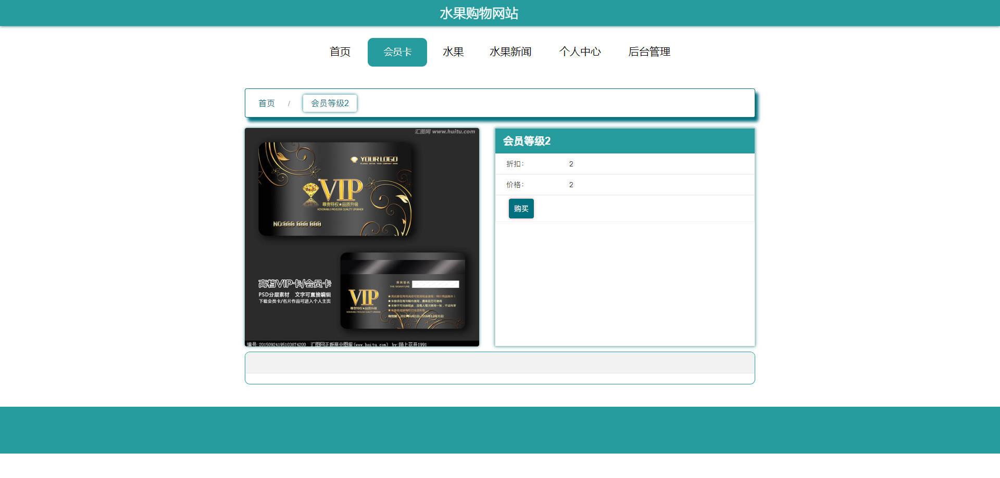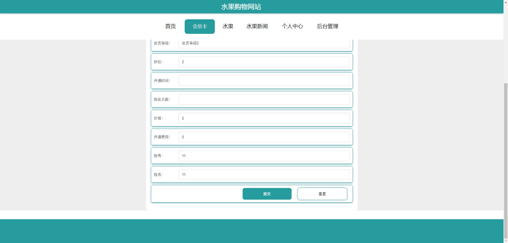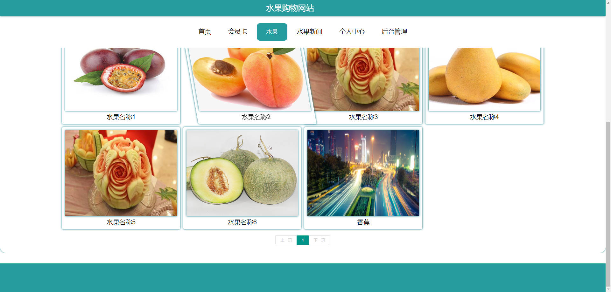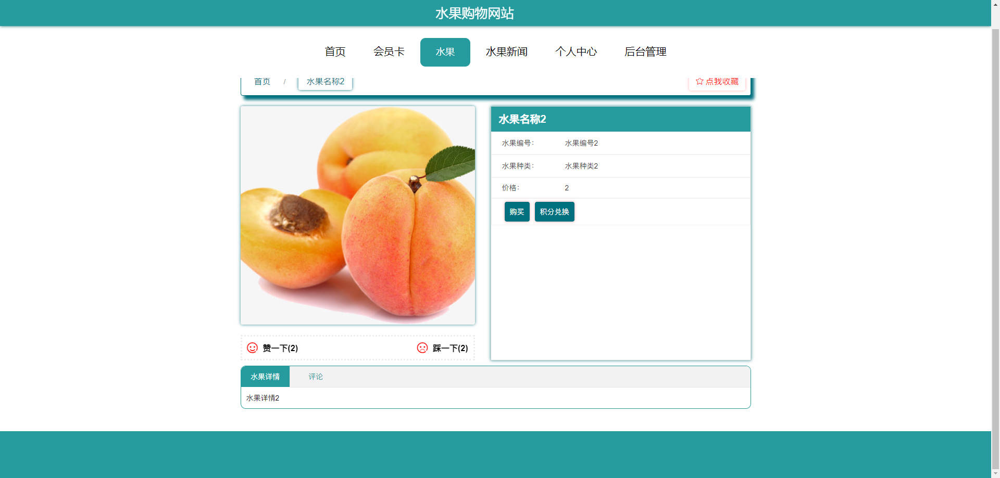

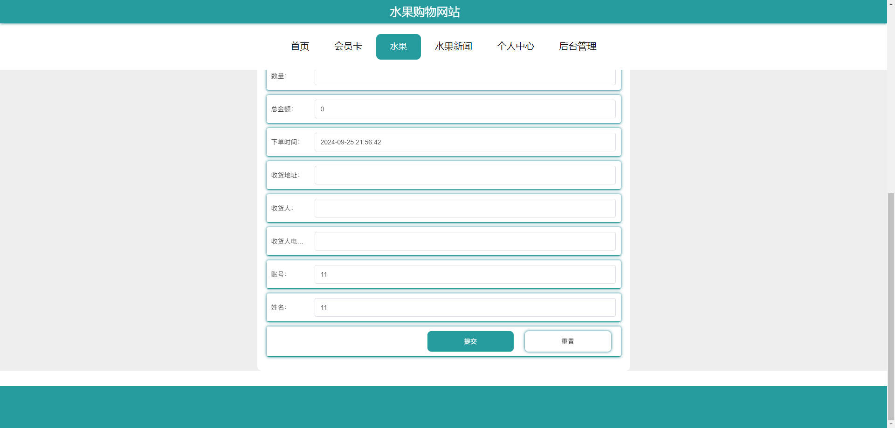

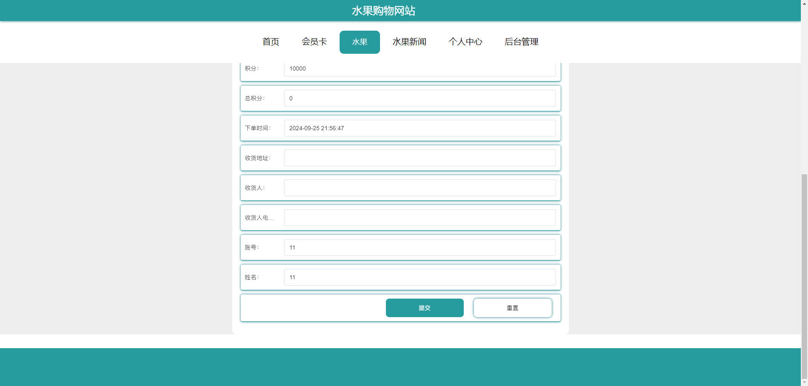

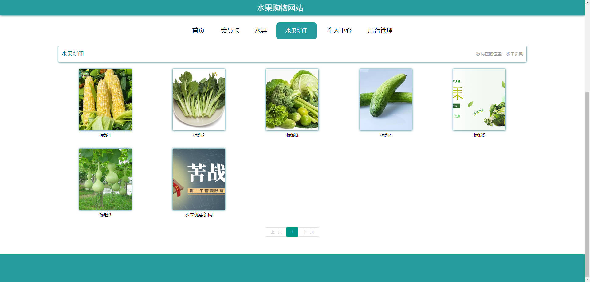

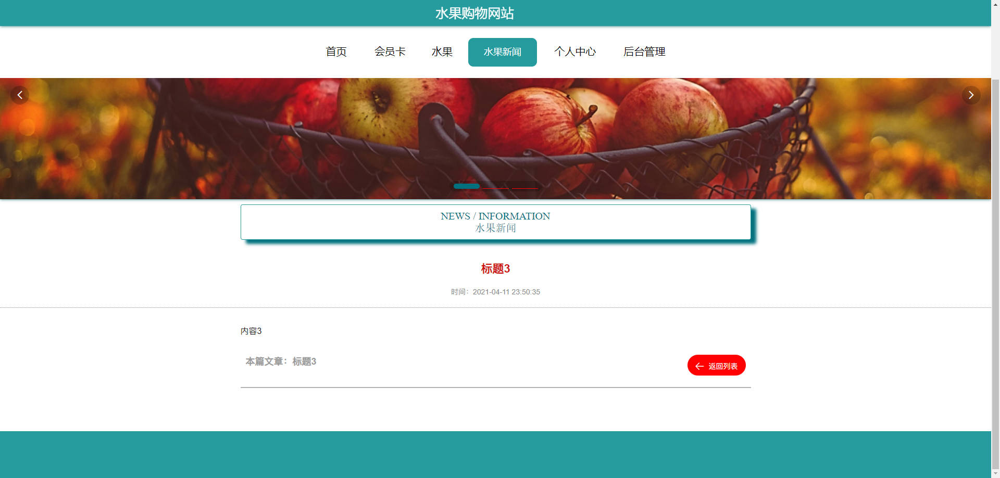

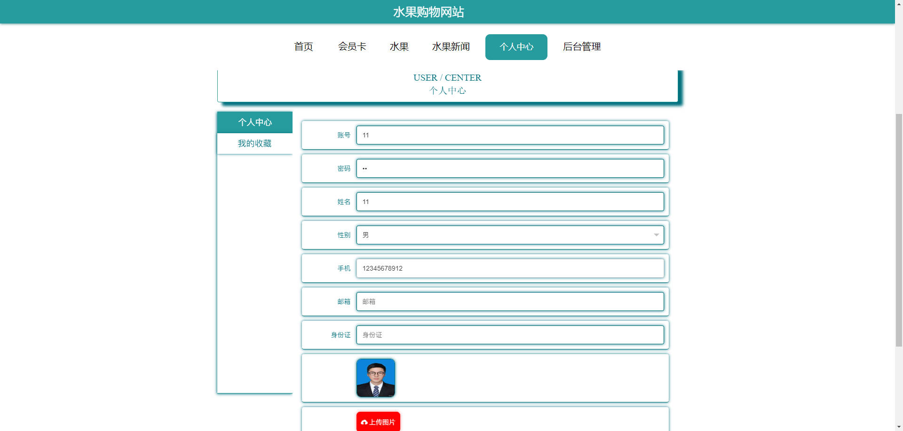

### 后台


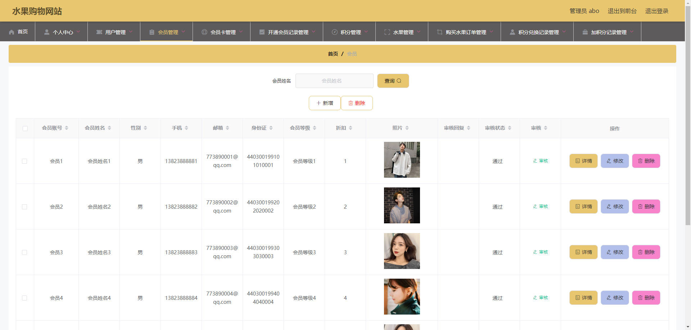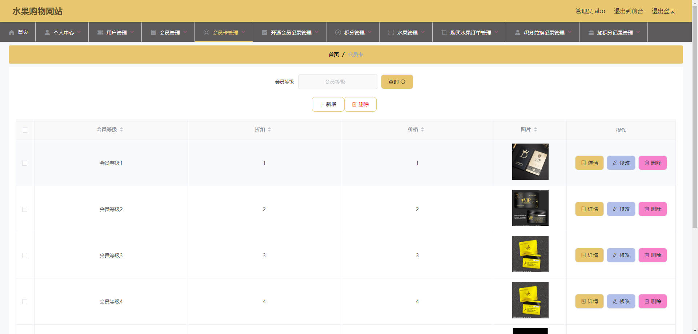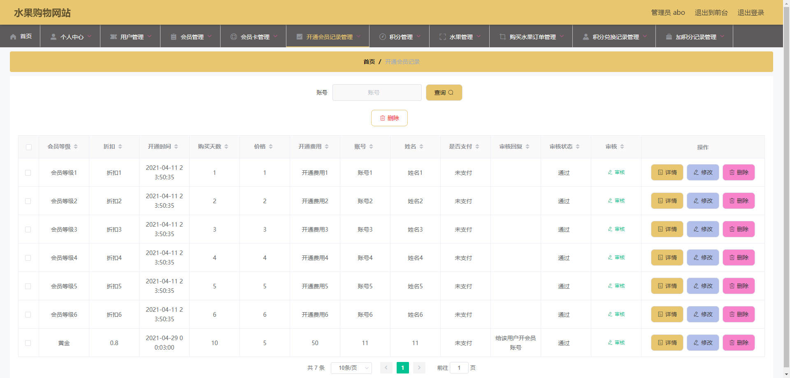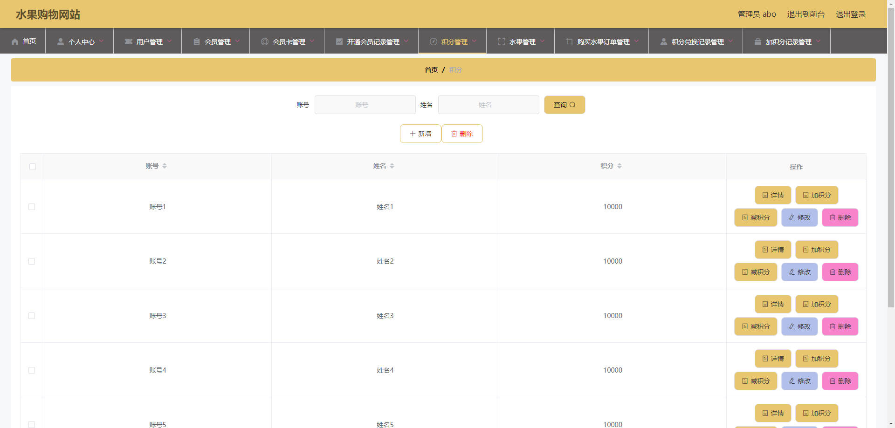

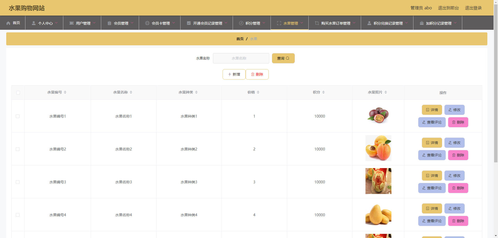

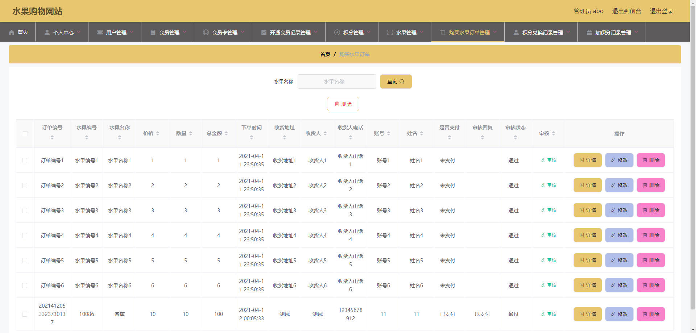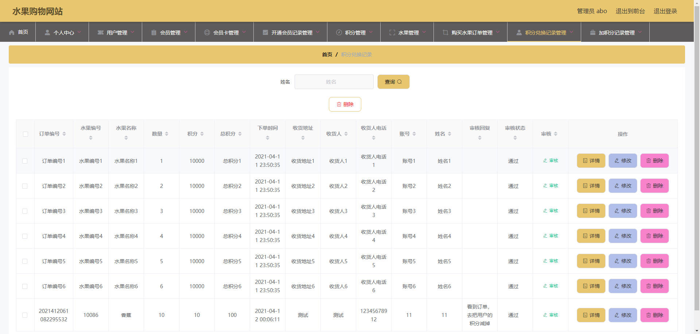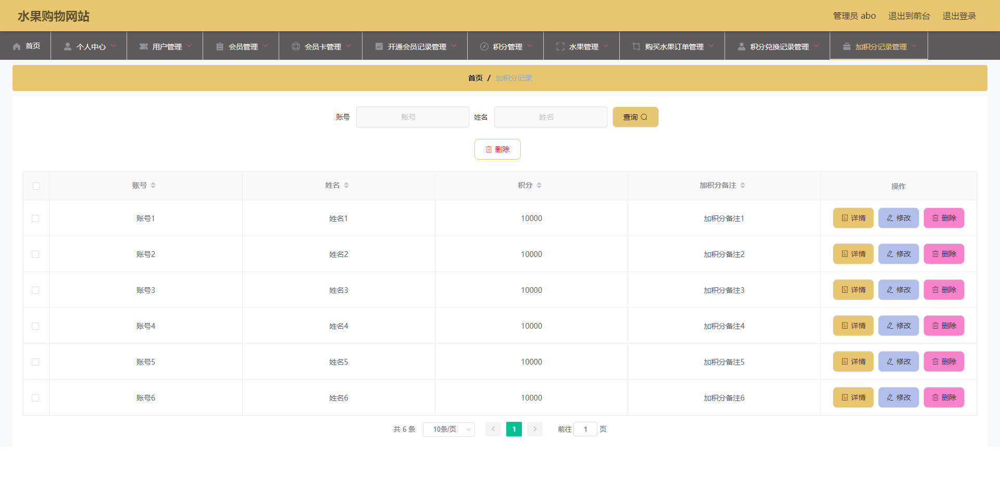

## 访问路径

### 前台

```properties
http://localhost:8080/springboot51rqt/front/pages/login/login.html

账号 11
密码 11
```

### 后台

```properties
http://localhost:8080/springboot51rqt/admin/dist/index.html#/login

账号 abo
密码 abo
```


## 功能图

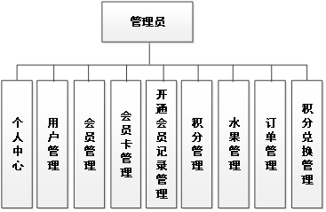

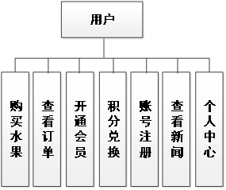

## 文档目录

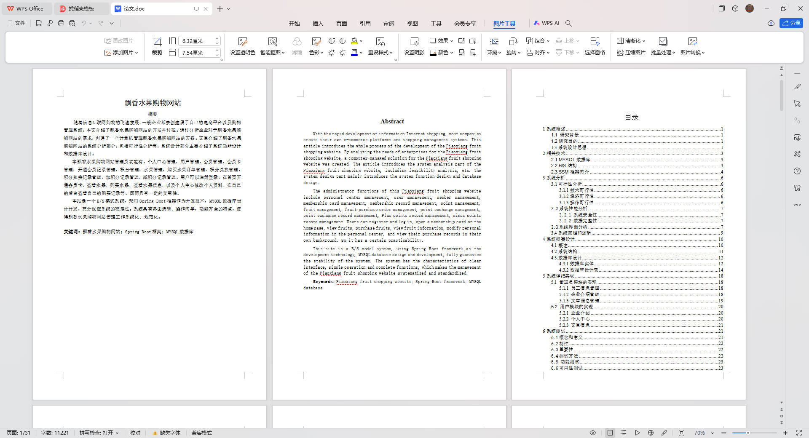


## 打赏或交流


